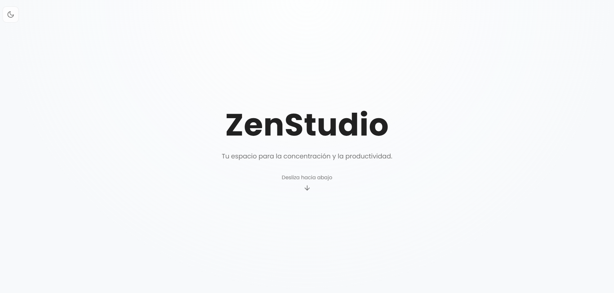
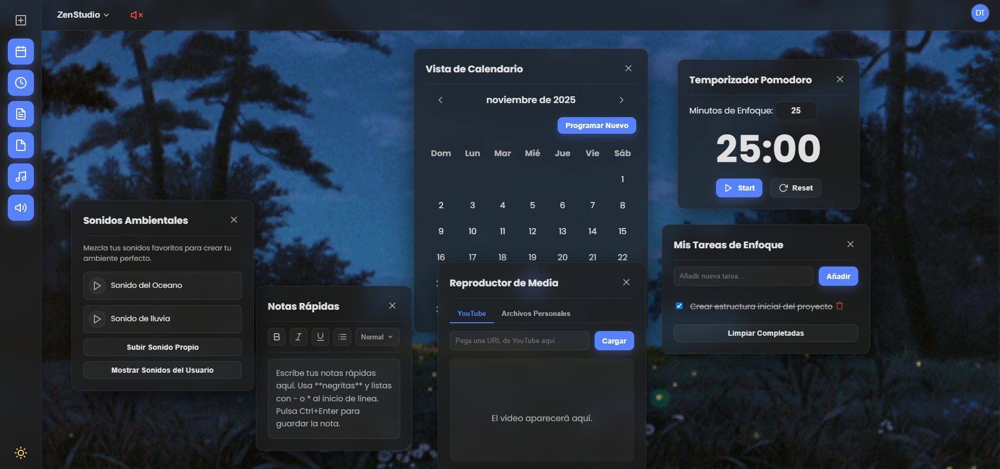

# ZenStudio

ZenStudio es una aplicación web diseñada para mejorar tu flujo de trabajo mediante un entorno personalizable y libre de distracciones. Combina herramientas esenciales de gestión de tiempo con una atmósfera relajante ajustada a tus gustos. Esta aplicación funciona como una "Single Page Application" (SPA) construida con tecnologías web estándar, ofreciendo una experiencia fluida sin recargas constantes.


## Demo
[ZenStudio](http://zenstudio.atwebpages.com/)


## Screenshots





##  Características Principales

1. **Sistema de Usuarios:** Registro y autenticación segura.
2. **Persistencia en Base de Datos:** Toda tu configuración, tareas y notas se guardan en una base de datos SQL, permitiendo acceder a tu cuenta desde cualquier dispositivo.
3. **Temporizador Pomodoro**: Totalmente personalizable y con notificaciones visuales para gestionar tus ciclos de trabajo y descanso.
4. **Mezclador de Sonidos Ambientales:**
 - Incluye sonidos predefinidos de alta calidad (Lluvia, Océano,Río, etc.).
 - Capacidad de subir tus propios audios desde tu equipo.
 - Control de volumen independiente para cada sonido (mezcla a tu gusto).
 - Interruptor "Master Mute" en la barra superior para silenciar todo al instante.
5. **Fondos Animados (Espacios)**: Cambia la atmósfera visual con fondos GIF (anime, hoguera, disco) o sube tus propias imágenes.
6. **Notas Rápidas**: Editor de texto enriquecido que soporta formato básico (negritas, cursivas, listas) y guarda todo automáticamente.
7.  **Calendario y Eventos**: Un planificador visual interactivo para organizar tu día.
8. **Gestor de Tareas**: Lista tipo "To-Do" simple con efectos de sonido al completar tareas.
9. **Reproductor Multimedia**: Integración para ver videos de YouTube sin salir de la app y reproductor de archivos locales (MP3).
10. **Interfaz Flotante**: Paneles estilo "ventanas" que puedes arrastrar (drag & drop), abrir y cerrar según lo necesites.
11. **Modo Oscuro/Claro**: Detección automática de preferencia de sistema y botón de cambio manual.
12. **Persistencia de Datos**: Todo tu progreso (tareas, notas, configuración, fondos personalizados) se guarda automáticamente en la memoria del navegador.


---

##  Tecnologías Utilizadas

### Frontend (Cliente)
* **HTML5:** Estructura semántica de las vistas.
* **CSS3:** Hojas de estilo modulares y variables para temas.
* **JavaScript (Vanilla ES6+):** Lógica del cliente modularizada.
* **React.js (JSX):** Componentes dinámicos para la Landing Page.

### Backend (Servidor)
* **PHP:** Lógica del servidor, manejo de sesiones, subida de archivos y API REST interna.

### Base de Datos
* **SQL:** Base de datos relacional para usuarios, configuración y contenido multimedia.

---
## Requisitos funcionales

1. **Gestión de Usuarios**
 -	RF-001: Sistema de registro de usuarios con email y contraseña
 -	RF-002: Sistema de autenticación y login
 -	RF-003: Perfil de usuario con información básica
 -	RF-004: Gestión de preferencias de usuario por sesión
   
2. **Personalización de Entornos**
 -	RF-005: Selección y cambio de fondos escénicos
 -	RF-006: Control de música ambiental (play/pause, volumen)
 -	RF-007: Biblioteca de sonidos ambientales 
 -	RF-008: Posicionamiento y ajuste de elementos en el espacio

3. **Gestión de Escenas**
 -	RF-009: Creación de escenas personalizadas
 -	RF-010: Guardado de configuraciones de escenas
 -	RF-011: Carga de escenas preconfiguradas

4. **Experiencia Inmersiva**
 -	RF-012: Reproducción simultánea de audio y visuales
 -	RF-013: Transiciones suaves entre elementos
 -	RF-014: Modo pantalla completa
 -	RF-015: Temporizador de sesión de enfoque
 -	RF-016: Minimización de interfaz para máxima inmersión

5. **Gestión de Tiempo y Productividad**
 -	RF-017: Sistema Pomodoro Integrado
 -	RF-018: Calendario de Planificación
 -	RF-019: Implementacion de lista para el control de tareas

---
---
## Requisitos no funcionales

1. **Usabilidad**
- RNF-001: Interfaz intuitiva y minimalista
- RNF-002: Tiempo de carga inferior a 3 segundos
- RNF-003: Diseño responsive para diferentes dispositivos
- RNF-004: Navegación con máximo 3 clics para funciones principales
2. **Rendimiento**
- RNF-005: Compatibilidad con los principales navegadores (Chrome, Firefox, Safari, Edge)
- RNF-006: Optimización de recursos multimedia
- RNF-007: Gestión eficiente de memoria para múltiples elementos
- RNF-008: Carga progresiva de recursos pesados
3. **Seguridad**
- RNF-009: Validación de datos de entrada

---

##  Estructura del Proyecto

```text
ZenStudio/
├── CSS/                       # Hojas de estilo modulares
│   ├── general.css            # Estilos base
│   ├── inicioSesion.css
│   ├── perfil.css
│   ├── principal.css          # Estilos del Dashboard
│   ├── registro.css
│   └── styleprueba.css
├── JS/                        # Lógica del Frontend
│   ├── fondos.js              # Gestión de fondos animados
│   ├── perfil.js              # Gestión de usuario
│   ├── principal.js           # Core del Dashboard
│   ├── principalP1.js a P5.js # Módulos divididos del dashboard
│   └── script.js
├── PHP/                       # Lógica del Backend (API & Controladores)
│   ├── inicioSesion.php
│   ├── registroUsuario.php
│   ├── paginaprincipal.php    # Vista protegida del Dashboard
│   ├── guardarConfiguracion.php
│   ├── subirFondoUsuario.php
│   └── ... (otros controladores)
├── db/                        # Base de Datos
│   └── zenstudio.sql          # Script de creación de tablas
├── JSX/                       # Componentes React
│   └── inicio.index.jsx
├── IMAGENES/                  # Recursos gráficos (Avatares, GIFs)
├── SONIDOS/                   # Recursos de audio base
├── index.html                 # Landing Page (Bienvenida)
├── registro.html              # Formulario de Registro
└── README.md                  # Documentación
```
## CREDITS AND AUTHORS

- Jesus Daniel Bacelis Santos - Desarrollador Frontend
- Oswaldo D'karlo Arceo Ramirez - Desarrollador Backend
- Jenrri Armin Puch Dzul - Desarrollador Backend
- Didier Francisco Cupul Tec - Desarrollador Frontend
